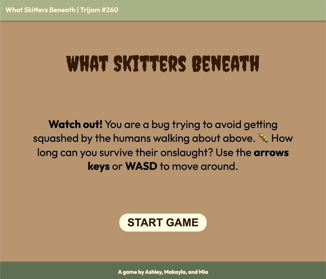

# trijam-260
Source code for amsqrd's Trijam 260 entry. The theme is "Underneath Us"

[Trijam](https://itch.io/jam/trijam-260) is a weekly game jam where the goal is to create a game in under 3 hours of development time.

## Synopsis

*What Skitters Beneath* is a simple web game where players are in control of a bug dodging the footsteps of humans above. Players move the bug in a grid with arrows keys or WASD.  As the game time elapses, the game increases in difficulty with the addition of more humans walking around.  




## Project Setup 

Run with a local web server

```bash
python -m http.server 8000
```

or 

```bash
python3 -m http.server 8000
```

## Built With

* Vanilla JavaScript
* Visual Studio Code
* Color Pallet from [Color Hunt](https://colorhunt.co/palette/5f6f52a9b388fefae0b99470)

## Third Party Assets

* [Mega Game Music Collection](https://www.gamedevmarket.net/asset/mega-game-music-collection/)
    * Hit_Hurt3.wav
    * The Superiority_looped.wav
* Mega SFX Pack
    * Powerup22.wav
* [Creeper Google Font](https://fonts.google.com/specimen/Creepster)
* [Outfit Google Font](https://fonts.google.com/specimen/Outfit)

## Useful Resource

* [Media query to detect if a touchscreen is present](https://stackoverflow.com/questions/11387805/media-query-to-detect-if-device-is-touchscreen)
* [Disable double tab zoom on mobile devices](https://stackoverflow.com/questions/10614481/disable-double-tap-zoom-option-in-browser-on-touch-devices)
* [Mute all sound with JavaScript on HTML page](https://stackoverflow.com/questions/14044761/how-to-mute-all-sound-in-a-page-with-js)
* [Emoji unicodes](https://www.iemoji.com/view/emoji/979/smileys-people/man-detective)

## Maintainers

* [Ashley Grenon - @townsean](https://github.com/townsean)
* [@matownsend4](https://github.com/matownsend4)
* [@mktownsend1](https://github.com/mktownsend1)

## License (MIT)

MIT License

Copyright (c) 2024 amsqrd

Permission is hereby granted, free of charge, to any person obtaining a copy
of this software and associated documentation files (the "Software"), to deal
in the Software without restriction, including without limitation the rights
to use, copy, modify, merge, publish, distribute, sublicense, and/or sell
copies of the Software, and to permit persons to whom the Software is
furnished to do so, subject to the following conditions:

The above copyright notice and this permission notice shall be included in all
copies or substantial portions of the Software.

THE SOFTWARE IS PROVIDED "AS IS", WITHOUT WARRANTY OF ANY KIND, EXPRESS OR
IMPLIED, INCLUDING BUT NOT LIMITED TO THE WARRANTIES OF MERCHANTABILITY,
FITNESS FOR A PARTICULAR PURPOSE AND NONINFRINGEMENT. IN NO EVENT SHALL THE
AUTHORS OR COPYRIGHT HOLDERS BE LIABLE FOR ANY CLAIM, DAMAGES OR OTHER
LIABILITY, WHETHER IN AN ACTION OF CONTRACT, TORT OR OTHERWISE, ARISING FROM,
OUT OF OR IN CONNECTION WITH THE SOFTWARE OR THE USE OR OTHER DEALINGS IN THE
SOFTWARE.
